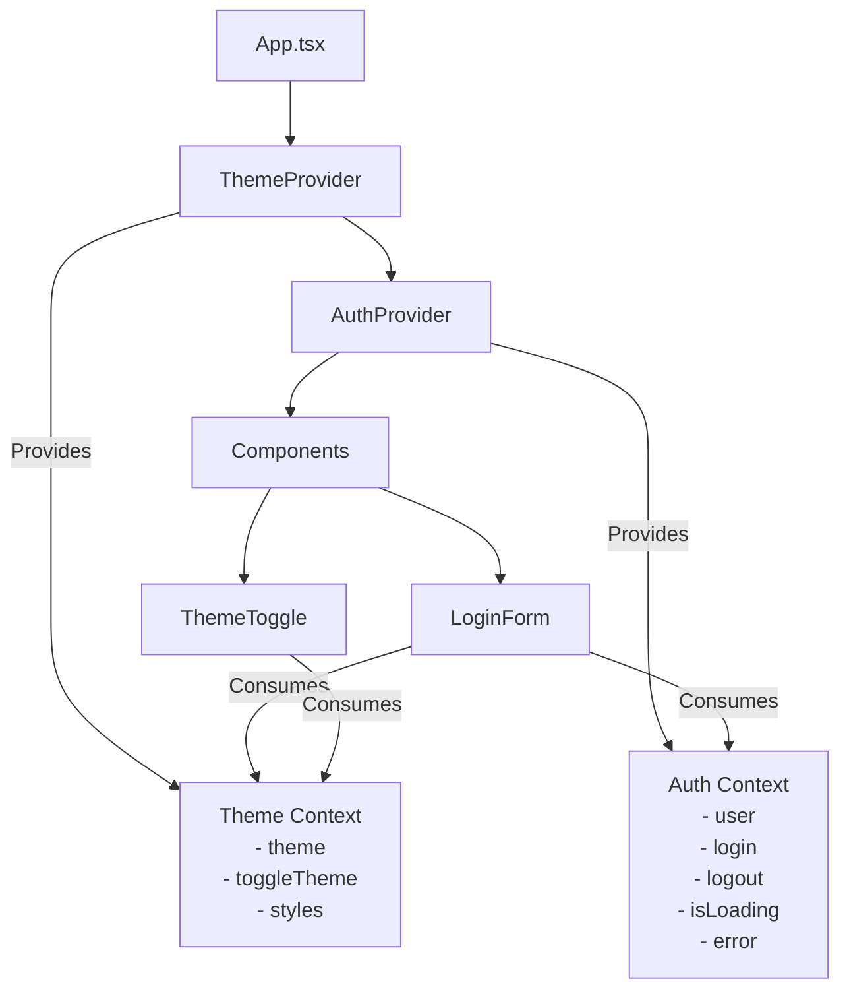
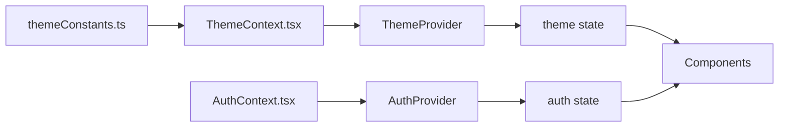
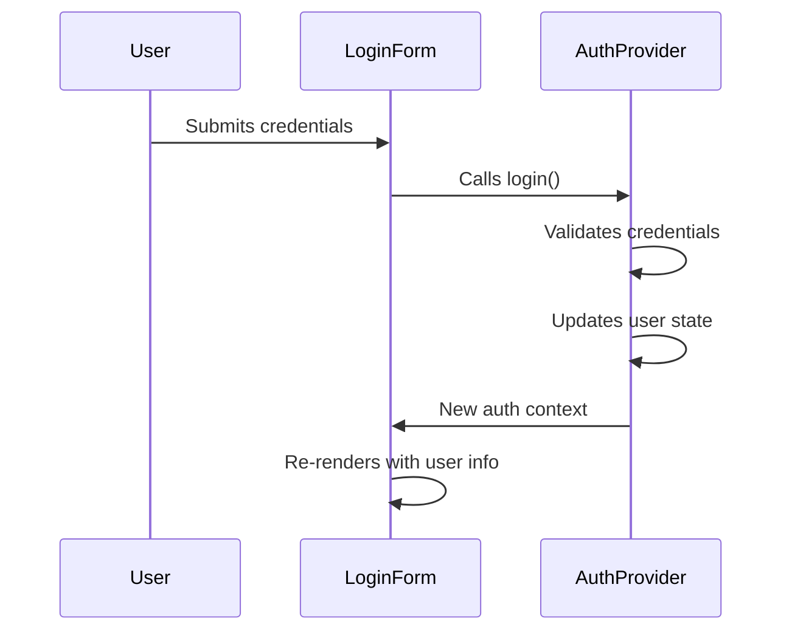

# Context

### Tech Stack

- UI Layer: React
- Language: Typescript
- Build Tool: Vite

### Setup

1. `npm install -g npm`
2. `npx create-vite .`
3. Select React
4. Select Typescript

### Installation

- `npm install`

### Start the Application

- `npm run dev`

### Avoid Errors

- I added "incremental": true to the compilerOptions
- Incremental compilation helps TypeScript compile only the files that have changed since the last compilation, which can significantly speed up build times

```json tsconfig.app.json
 "incremental": true,
```

### Context

#### Application Architecture



#### Data Flow



#### Authentication Flow Sequence


